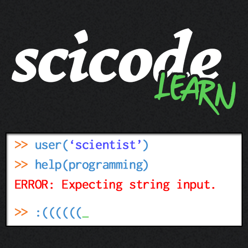

# scicode-learn
:star2: Welcome! :star2:

The goal of **scicode-learn** is to be an aggregation website for scientific programming resources. The project is particularly geared towards intro-to-programming material and guides that are more field-specific (e.g., making psychology experiments, data analyses for genetics research, etc.). The website will aggregate resources—from cheatsheets to online courses—particularly in Python, R, and Matlab, but also in other languages.

If you're interested in contributing to the website, check us out on Github!

[https://github.com/scicode-learn/scicode-learn](Github repository)

scicode-learn a riff off of #scicode and scikit-learn. (See this [blog post](https://medium.com/@cMadan/scicode-learn-collecting-thoughts-ff22443f3dda) for some thoughts on the original inspiration for the project.)

### Why should I learn to program?

A lot of budding scientists are interested in their particular discipline and have not received formal or sufficiently substantiative programming training. Even more so, in some fields, trainees feel like programming 'isn't for them' or otherwise sometimes avoid learning to program. However, scientific programming undoubtedly leads to more efficient research analyses and is the path towards open and reproducible science.

Being able to program your analysis definitely involves a learning curve, but with some practice, programming could save you weeks of manual effort, make you more self sufficient, and could even make some otherwise unfeasible analyses possible. Additionally, programming is an important facet of conducting reproducible research. Reproducibility is an important facet of scientific research, but non-computational workflows are difficult to construct as reproducible pipelines. By having a better understanding of scientific programming, we hope that scientists will be better able to conduct their research and share their analysis methods with others.